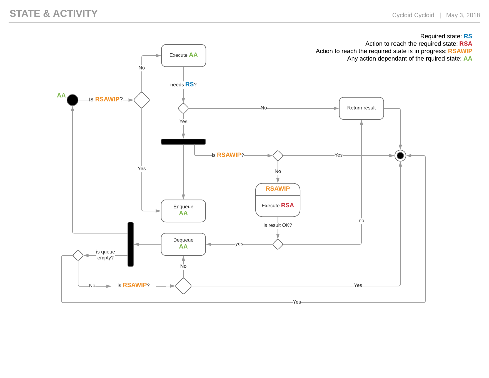
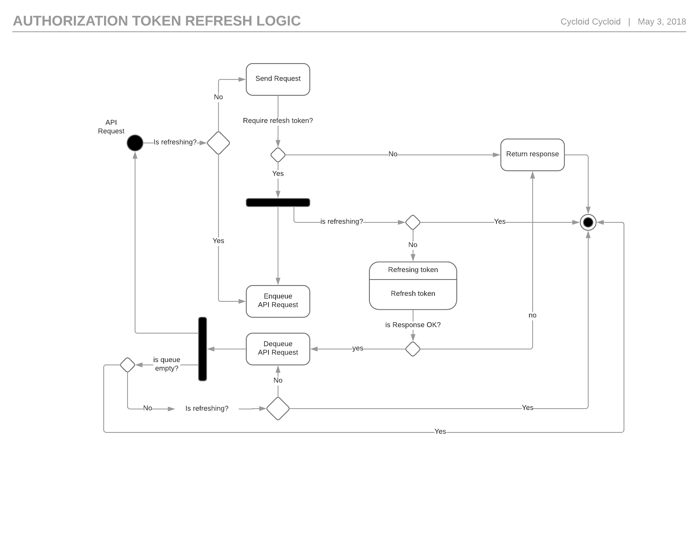

# State Updater on Actions

Small JS module for calling asynchronous actions which require an "updated state", in order to be executed.

## Install

You can install it using _NPM_.

```
npm install state-updater-on-actions
```

Use the `--save` or `--saveDev` parameters accordingly your needs.

## How to use it

You can import the ES2016 version of this module or an ES5 one. The first one is informed in the _package.json_ file with the property _module_, the second one as _NPM_ has done since the early moments with the property _main_.

If your system supports ES2016 modules but it isn't automatically checking the _module_ property and you want to use the ES2016 version, then you can import directly the same script indicated by the _module_ property, present in the _pacakge.json_ file.

Using the ES2016 version is recommended when you are using this module on an application that you have a bundler which fully care of the ES2016 transformations, so the transformation of this one can be optimized together with the transformations that your own sources, avoiding to repeat general code that all the ES5 transpiled files require.

On the other hand, if you need the ES5 version, you can directly require the module, or even you need it so, you could require the script indicated in the _main_ property of the _pacakge.json_ file.

## Is it production ready?

It should be; we developed the module with tests and currently it has 100% coverage, in case that's a metric that matters to you.

We started to use it in production in the front-end of our product, however it hasn't passed too much time since we developed and started to use it, so, for being cautious, we decided to keep the version of the module on `0.0.X`, which means that's in development. In reality, we don't expect any change in the public API, and if we don't realize that we have to do any and we don't find any issue with this module in our production environment for a several weeks, then we'll bump its version to `1.0.0`.

So far, we can say, **use it under your risk**.

## Rationale

Small JS module which allows to call asynchronous actions which are required to have an "updated state", which is shared by all them, and when the state isn't up to date, they get, some how, a result which notifies them to update the state previous to be executed again, in order to be executed.

A clear example is a _HTTP API service_ which requires to send an updated authorization token for some of its endpoints, so the actions, which are requests to such endpoints, send the authorization token on each request and the server responds, some how (status HTTP code, specific header, etc), that the request cannot be fulfilled, when the token is outdated, until the token is up to date; the _API_ offers a specific endpoint which allow to renew/refresh the token, in order to update it.

Meanwhile a _auto state_ functionality can be implemented inside of the business logic, this module abstract such part from it, making the logic of this functionality easy to be tested and not to have to repeated each time that's needed.

This module has an implementation which avoids multiple calls to the _state update action_ (henceforth _updater_) and/or actions, when more than one action has been called and notified with a _"required updated state"_, because, meanwhile the _updater_ is executing, the _actions_ are on hold and the ones which were run concurrently, previously any of them was notified with a _"required updated state"_, the _updater_ is only called once, and when it finishes successful, the actions are recalled, when they were called previous the notification, or called, when they were on hold. In case that the _updater_ finishes unsuccessful, all the actions calls return the result of the _updater_.

In the following image, you can see an UML state/activity diagram of the implemented logic by this module.



Below, the same diagram but for the _HTTP API service_ commented above.



## API

As commented in the [rationale](#rationale), the _actions_ must be asynchronous; the _updater_, which itself an action too, must be asynchronous; hence, both, the _actions_ and the _updater_, must be asynchronous functions, in terms that they always return a _Promise_.

On the other hand, the _updater_ must be determined previously to be used, it's likely the most of the cases and we haven't thought in any use case which may need to change the _updater_ once an instance returned by one of the constructor functions of this module; however, it doesn't mean that there is one, so if you have one which require it, you may want to open an issue to expose it and we'll decide if we should create a new version of the module which allow to do so or not.

The public source code (i.e. the public API or exported functions, if you want to called it in such way) is documented using the [JSDoc syntax](http://usejsdoc.org), so you can see the [API documentation in the Github pages of this repository under the path _docs/api_](http://cycloidio.github.io/state-updater-on-actions/docs/api).

### Notes about the implementation

The API of the module, may look a bit weird if you consider that it's a _javascript_ module and we could have done the same with only one function; however we believe, maybe influenced by other programming languages, __explicit is clear than implicit__, so the constructor and one of the methods exposed by the instances returned by the constructors, have a counterpart which do the same but allowing to pass a _context object_ (that's basically that the updater or action will be called with `bind` JS function, using such _context_).

Another thing to state is that _JS Classes_ haven't been used for the implementation, and you may think that we should/have/may use them, meanwhile that's totally right, we have our reasons for not using them, so we haven't used them because we don't know them, it's a mistake or another thing, it's our choice.

We have written this section with these 2 clarifications, to make you aware of them, and avoid that you be in a doubt of them and open an issue with the only purpose of changing so.

## Development

A conventional _NodeJS_ development, so you need _Node_ and _NPM_.

Although _BabelJS_ is used, you'll see that in the _packgage.json_ file, it's indicated that _node_ should be greater or equal than `9.0.0`, that is because we developed with it and we haven't bother to test it in previous _Node_ versions, so we know that it work on this version and we can ensure that it will probably work in the following newer versions, but we don't know if it works on previous ones, although we think that in some previous ones should.

The _pacakge.json_ also contains the _scripts_ which are needed when developing this module, they are self explanatory and some of them must be used in a branch which is sent through a PR, as they are required to run without any error in order to be accept and merged. Because you should familiar with _NPM_, and they are pretty clear, we don't list them in this document, basically, go an check _package.json_ file _scripts_ property to find them out.

Currently, everything must be run manually, we have planned to add a [CI configuration at some point to run the _linter_ and _tests_ on new PRs](https://github.com/cycloidio/state-updater-on-actions/issues/3) and [run the _build_ and _NPM publish_ once a PR is merged into the _master branch_](https://github.com/cycloidio/state-updater-on-actions/issues/5) and [update the Github pages when the master branch gets updated](https://github.com/cycloidio/state-updater-on-actions/issues/6), but for now isn't done.

The module is developed with ES2016 version, all the source is _src_ including the _tests_, which are the files with the extension _*.spec.js_; however for not excluding possible consumers that requires to use an JS ES5 version, the sources are transpiled, with BabelJS, and made them available in the _dist_ directory; that's what the _NPM script build_ targets does.

### Steps to do/check before merging a PR

Meanwhile there is not automation for some tasks, the following steps must be done/checked before merging a PR to master and just after it is merged.

1. Verify that the following _NPM scrips_ execute without any error: `lint` and `test`.
2. Update the ES5 version of the module with the _NPM script_ `build`.
3. Make sure that the _package-lock.json_.
4. Regenerate the API docs if they have been updated and published them in the GH pages branch.
5. Once is merged into _master_, bump the _package_ version and publish it in _NPM_.

## License

The MIT License (MIT)
Copyright (c) 2018 cycloid.io
Read the LICENSE file for more information.
